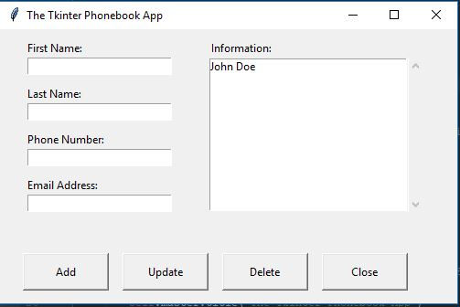

# Phonebook Application

## General Info:
This is a phonebook application that I created to allow the user to ADD, UPDATE and DELETE contacts in an SQL database. The scripting work was done in the Python language. A friendly user interface was created to allow the user to flawlessly edit their phonebook. 



## Technologies 
I developed the user interface by deploying the tkinter modules. Tkinter is an effective library that gives the developer the ability to create customizable interfaces for applications. An easy to use grid geometry is used to place text windows and buttons. The Button module is used to not only create the button but call upon a function within the code to perfrom an action.

```
    self.btn_add = tk.Button(self.master, width=12, height=2, text='Add',
                             command=lambda: phonebook_functions.addToList(self))
    self.btn_add.grid(row=8, column=0, padx=(25, 0), pady=(45, 10), sticky=W)
    self.btn_update = tk.Button(self.master, width=12, height=2, text='Update',
                                command=lambda: phonebook_functions.onUpdate(self))
    self.btn_update.grid(row=8, column=1, padx=(15, 0), pady=(45, 10), sticky=W)
    self.btn_delete = tk.Button(self.master, width=12, height=2, text='Delete',
                                command=lambda: phonebook_functions.onDelete(self))
    self.btn_delete.grid(row=8, column=2, padx=(15, 0), pady=(45, 10), sticky=W)
    self.btn_close = tk.Button(self.master, width=12, height=2, text='Close',
                               command=lambda: phonebook_functions.ask_quit(self))
    self.btn_close.grid(row=8, column=4, columnspan=1, padx=(15, 0), pady=(45, 10), sticky=E)
```
The queries and creation of the database were easily executed using the sqlite3 modules. For example the code snippet below is the basic function to create the dB and begin the first iteration through the program. 

```
def create_db(self):
    conn = sqlite3.connect('db_phonebook.db')
    with conn:
        cur = conn.cursor()  # cursor is required for SQL queries
        cur.execute("CREATE TABLE if not exists tbl_phonebook( \
            ID INTEGER PRIMARY KEY AUTOINCREMENT, \
            col_fname TEXT, \
            col_lname TEXT, \
            col_fullname TEXT, \
            col_phone TEXT, \
            col_email TEXT \
            );")
        # must commit() to save changes & close the database connection
        conn.commit()
    conn.close()
    first_run(self)  # function below called upon for first run through the program
```
