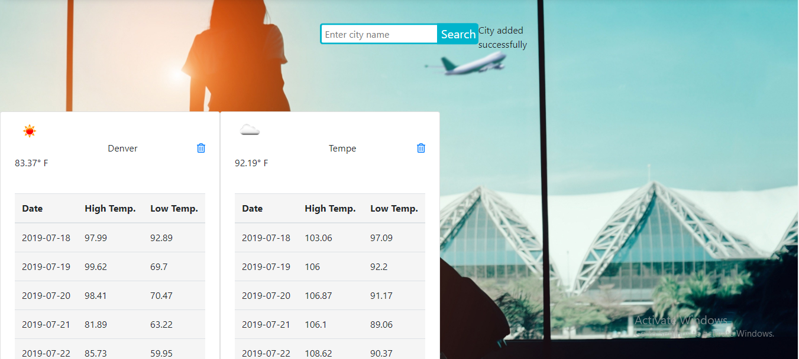

# Travel Scrape Website

## General Info
For two weeks, I worked with my peers at The Tech Academy in an Agile environment to develop a full scale django web application in the Python language. We each picked user stories and went to work on developing applications that would make the site user friendly. The main functionality of the site was to provide a person looking to travel with relevant information such as weather info, hotel pricing, flight information, restaurant listings and even currency conversion tools. My main contribution included the weather app, which incorporated front-end and back-end work. See below for my details on my contributions to the site. During the two week sprint I had the opportunity to utilize the Azure DevOps project management tool and Git Bash for version control. These are skills that I'm confident in using and I'm sure will be much needed in the professional world. 

## Contributions and Skills Learned
* [Weather Application](#weather-application)
* [Skills Learned](#skills-learned)

### Weather Application
This application had two main deliverables. One was to be able to allow the user to search for a city by its name and return the current weather forecast for that specified city. The second was to also return a 5 day weather forecast. I was able to accomplish this by utilzing the "openweathermap" API which I converted to a JSON request. I wanted to gather the necessary information from the API and render it to the screen for the user to view. I included some back-end functionality that would store the city the user searched for into the database. That way the user could look-up multiple cities at once and then delete those cities from their view once they were satisfied. 
```

 form = CityForm()

    cities = City.objects.all()  # making object cities from City class.
    # forecast_data = []
    weather_data = []  # initialize list for weather data.
    # Loop through cities object.
    for city in cities:

        r = requests.get(url.format(city)).json()  # r is the request object for the current weather
        f = requests.get(url_forecast.format(city)).json()  # f is the request object for the 5 day forecast

        # gathering relevant information from 5-day forecast.
        temp_min = []
        temp_max = []
        current_date = ''
        days = []
        for item in f['list']:
            time = item['dt_txt']
            next_date, hour = time.split(' ')

            if current_date != next_date:
                current_date = next_date
                temp_min.append(None)
                temp_max.append(None)
                days.append(current_date)
            temperature = item['main']['temp']
            if not temp_min[-1] or temperature < temp_min[-1]:
                temp_min[-1] = temperature
            if not temp_max[-1] or temperature > temp_max[-1]:
                temp_max[-1] = temperature

        city_weather = {
            'city': city.name,  # passing the name that represents each city
            'temperature': r['main']['temp'],
            'forecast': '',
            'icon': r['weather'][0]['icon'],
            'date': days,
            'high_temp': temp_max,
            'low_temp': temp_min,
        }

        weather_data.append(city_weather)  # append city_weather dictionary to the weather_data list

    # Pass weather_data info over to the template
    context = {
        'weather_data': weather_data,
        'form': form,
        'message': message,
        'message_class': message_class,
    }

    return render(request, 'WeatherApp/index.html', context)
    
```

I also added a script that would send certain error messages to the user if they happend to type in an incorrect city name or a duplicate city name. The delete function was added so that the user could add and delete the cities they were looking for directly from their screen. 
```

    err_msg = ''
    message = ''  # message that user sees
    message_class = ''  # holds a css class for the color of the message area

    # create object from City data and save it
    if request.method == 'POST':
        form = CityForm(request.POST)
        # making sure the data is valid and that the same city names don't get added to the list
        if form.is_valid():
            new_city = form.cleaned_data['name']
            existing_city_count = City.objects.filter(name=new_city).count()
            if existing_city_count == 0:  # save the form if the city doesn't already exist
                r = requests.get(url.format(new_city)).json()  # returns data for city that gets added.
                if r['cod'] == 200:  # compares the cod to check if it's a valid city within the API
                    form.save()
                else:
                    err_msg = 'City does not exist.'
            else:
                err_msg = 'City already exists in the database!'
        if err_msg:
            message = err_msg
            message_class = 'is-danger'
        else:
            message = 'City added successfully'
            message_class = 'is-success'


def delete_city(request, city_name):
    City.objects.get(name=city_name).delete()
    return redirect('home')

```
City forecast views. I edited the HTML and CSS files to create a decent looking display of all the relevant information. As you can see the user can view multiple cities with their 5-day forecast information.



### Skills Learned
* Working with a group of developers in an Agile environment doing two weeks sprints. We used the Azure DevOps environment and communicated over a Slack channel. 
* Python and the Django web framework were the main technologies used. I also utilzied SQLite for the database and HTML, CSS for front-end development.
* Third party API data scraping. I learned how to scrape the web for information from an API and render it to my application.
